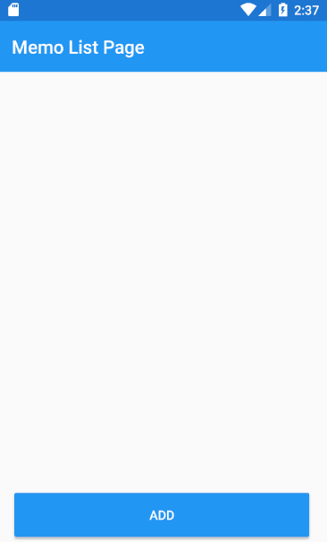

# CTRL Xamarin講習 ハンズオン手順書

これは、Xamarin.FormsとPrismを使ってメモ帳を作るハンズオンです。

## 手順 1 ：ソリューションファイルを開く

事前準備で用意したフォルダの中にある「`CTRLXamarinHandsOn.sln`」を開いてください。

ソリューションエクスプローラを見ると、4つのプロジェクトで構成されているのが分かります。

|#|プロジェクト名|概要|実行環境|
|----|----|----|----|
|1 | `CTRLXamarinHandsOn`|共通コード部分が入っている .NET Standard Project。|（不問）|
|2 | `CTRLXamarinHandsOn.Android`|Android アプリケーション|（不問）|
|3 | `CTRLXamarinHandsOn.iOS`|iOS アプリケーション|実行には Mac が必要|
|4 | `CTRLXamarinHandsOn.UWP`|Windows 10 UWP アプリケーション|実行には Windows 10 Fall Creators Update & VS 2017 が必要|

## 手順 2 : Modelを作る - Memo

まずはメモそのものを表すMemoクラスを作ります。

### 変更通知プロパティを追加する

1. `CTRLXamarinHandsOn (共通部分)` プロジェクトの中の `CTRLXamarinHandsOn/Models/Memo.cs` ファイルを開きます。
1. Memo クラスの中に、`// ここにプロパティを追加`というコメントがあるので、その下に以下の変更通知プロパティを追加してください。

【Prismのスニペットを使おう】「propp」と打って tab + tab すると、変更通知プロパティを自動で生成してくれます。  
自動生成後は tab を押すことで入力位置を移動できます。

```csharp
private string _id;
public string Id
{
    get { return _id; }
    set { SetProperty(ref _id, value); }
}
private string _title;
public string Title
{
    get { return _title; }
    set { SetProperty(ref _title, value); }
}
private string _text;
public string Text
{
    get { return _text; }
    set { SetProperty(ref _text, value); }
}
```

### コンストラクタを追加する

メモを更新や削除を行う際にメモを一意に決定したいのでMomoクラスのコンストラクタでIdにGUID（MicrosoftのUUID実装）を割り当てることにします。

>【コンストラクタ】  
>クラスのインスタンス生成時に実行されるメソッド。  
>主にそのクラスのメンバ変数を初期化するときに使う。

>【UUID】  
>ソフトウェア上でオブジェクトを一意に識別するための識別子。  
>1兆個のUUIDを生成しても、生成したUUIDが重複する確率は、隕石が頭に降ってくる確率より低い。

同じくMemo　クラスの中に`// ここにコンストラクタを追加`というコメントがあるのでその下に以下のコンストラクタを追加してください。

【スニペットを使おう】「ctor」と打って tab + tab すると、コンストラクタを自動で生成してくれます。

```csharp
public Memo()
{
    Id = Guid.NewGuid().ToString();
}
```
### 確認

現在、`Memo.cs`は下のようになっているはずです。

```csharp
using Prism.Mvvm;
using System;

namespace CTRLXamarinHandsOn.Models
{
    public class Memo : BindableBase
    {
        // ここにプロパティを追加
        private string _id;
        public string Id
        {
            get { return _id; }
            set { SetProperty(ref _id, value); }
        }
        private string _title;
        public string Title
        {
            get { return _title; }
            set { SetProperty(ref _title, value); }
        }
        private string _text;
        public string Text
        {
            get { return _text; }
            set { SetProperty(ref _text, value); }
        }

        // ここにコンストラクタを追加
        public Memo()
        {
            Id = Guid.NewGuid().ToString();
        }
    }
}
```

## 手順 3 : Modelを作る - MemoHolder

次に複数のメモを管理するMemoHolderクラスを作ります。

### 変更通知プロパティ（ObservableCollection）を追加する

>【ObservableCollection】  
>自分の中身が変わったことを検知する仕組みを持っているコレクション。
>C++のvectorが進化したものだと考えておこう。

1. `CTRLXamarinHandsOn (共通部分)` プロジェクトの中の `CTRLXamarinHandsOn/Models/MemoHolder.cs` ファイルを開きます。
1. MemoHolder クラスの中に、`// ここにプロパティを追加`というコメントがあるので、その下に以下の変更通知プロパティ（ObservableCollection）を追加してください。

```csharp
private ObservableCollection<Memo> _memos;
public ObservableCollection<Memo> Memos
{
    get { return _memos; }
    set { SetProperty(ref _memos, value); }
}
```

### メモの追加、読み込み、更新を行うメソッドを追加する

メモのコレクションの保存、読み込みする関数を追加します。
ここは長いのでコピペでいきましょう。

>【メソッド】  
>クラスが持っている関数のこと。  
>C++のメンバ関数と同じ意味。

`// ここにパブリック関数を追加`というコメントの下に以下の関数をコピペします。（気合がある人はタイピングしてね）

```csharp
public async Task AddAsync(Memo memo)
{
    Memos.Add(memo);
    await SaveToJson();
}
public async Task LoadAsync()
{
    var rootFolder = FileSystem.Current.LocalStorage;
    var file = await rootFolder.CreateFileAsync("MazaiNotes.json", CreationCollisionOption.OpenIfExists);
    var jsonString = await file.ReadAllTextAsync();
    Memos = JsonConvert.DeserializeObject<ObservableCollection<Memo>>(jsonString) ?? new ObservableCollection<Memo>();
}

public async Task Update(string memoId, Memo memo)
{
    for (int i = 0; i < Memos.Count; i++)
    {
        if (Memos[i].Id == memoId)
        {
            Memos[i].Title = memo.Title;
            Memos[i].Text = memo.Text;
        }
    }
    await SaveToJson();
}

public async Task Delete(string memoId)
{
    int removeIndex = -1;
    for (int i = 0; i < Memos.Count; i++)
    {
        if (Memos[i].Id == memoId)
        {
            removeIndex = i;
        }
    }
    Memos.RemoveAt(removeIndex);
    await SaveToJson();
}
```

### SaveToJsonメソッドを作る

メモのコレクションをJsonファイルに保存する関数を作ります。
この関数は先程コピペして作った関数の共通部分を抜き出してきたものです。

`// ここにプライベート関数を追加`というコメントの下に`SaveToJson`という名前のメソッドを作ります。

```csharp
private async Task SaveToJson()
{

}
```

これから、この SaveToJson メソッドの中にコードを書いていきます。

次に、Json.netを使用してメモのコレクションをシリアライズします。

>【シリアライズ】  
>オブジェクト（インスタンス）をバイト列に変換すること。  
>シリアライズすることによって、JSON、XML、バイナリなどの形式でファイルに保存できるようになる。  
>インスタンスをまるごと保存できる。すごく便利。

>【デシリアライズ】  
>シリアライズされたファイルからオブジェクトを復元すること。  
>シリアライズの逆。  

```csharp
var jsonString = JsonConvert.SerializeObject(Memos);
```

次に、Jsonファイルを保存するフォルダを取得します。Android,
iOS,UWPそれぞれで保存する場所が違うため、PCLStorageを使用してフォルダを取得します。

```csharp
var rootFolder = FileSystem.Current.LocalStorage;
```

次に、Jsonファイルを保存するJsonファイルを取得します。ファイル名は Memos.jsonとし、もしファイルが既に存在するなら空のファイルで上書きするようオプションを設定します。

```csharp
var file = await rootFolder.CreateFileAsync("Memos.json", CreationCollisionOption.ReplaceExisting);
```

最後に、シリアライズしたメモのコレクションをJsonファイルに書き込みます。

```csharp
await file.WriteAllTextAsync(jsonString);
```

### コンストラクタを追加する

後になりましたがコンストラクタを追加していきます。

コンストラクタ内ではJsonファイルを読み込む関数を呼んでおきます。

MemoHolder　クラスの中に`// ここにコンストラクタを追加`というコメントがあるのでその下に以下のコンストラクタを追加してください。

```csharp
public MemoHolder()
{
    LoadAsync();
}
```

ここまでできたら一度ビルドしてみましょう。ソリューションエクスプローラからCTRLXamarinHandsOnを右クリックし、ビルドをクリックしましょう。エラーが出ずにビルドが終われば成功です。


### 確認

現在、`MemoHolder.cs`は下のようになっているはずです。

```csharp
using Newtonsoft.Json;
using PCLStorage;
using Prism.Mvvm;
using System.Collections.ObjectModel;
using System.Threading.Tasks;

namespace CTRLXamarinHandsOn.Models
{
    public class MemoHolder : BindableBase
    {
        // ここにプロパティを追加
        private ObservableCollection<Memo> _memos;
        public ObservableCollection<Memo> Memos
        {
            get { return _memos; }
            set { SetProperty(ref _memos, value); }
        }

        // ここにコンストラクタを追加
        public MemoHolder()
        {
            LoadAsync();
        }

        // ここにパブリック関数を追加
        public async Task AddAsync(Memo memo)
        {
            Memos.Add(memo);
            await SaveToJson();
        }

        public async Task LoadAsync()
        {
            var rootFolder = FileSystem.Current.LocalStorage;
            var file = await rootFolder.CreateFileAsync("MazaiNotes.json", CreationCollisionOption.OpenIfExists);
            var jsonString = await file.ReadAllTextAsync();

            Memos = JsonConvert.DeserializeObject<ObservableCollection<Memo>>(jsonString) ?? new ObservableCollection<Memo>();
        }

        public async Task Update(string memoId, Memo memo)
        {
            for (int i = 0; i < Memos.Count; i++)
            {
                if (Memos[i].Id == memoId)
                {
                    Memos[i].Title = memo.Title;
                    Memos[i].Text = memo.Text;
                }
            }
            await SaveToJson();
        }

        public async Task Delete(string memoId)
        {
            int removeIndex = -1;
            for (int i = 0; i < Memos.Count; i++)
            {
                if (Memos[i].Id == memoId)
                {
                    removeIndex = i;
                }
            }
            Memos.RemoveAt(removeIndex);
            await SaveToJson();
        }

        // ここにプライベート関数を追加
        private async Task SaveToJson()
        {
            var jsonString = JsonConvert.SerializeObject(Memos);

            var rootFolder = FileSystem.Current.LocalStorage;
            var file = await rootFolder.CreateFileAsync("MazaiNotes.json", CreationCollisionOption.ReplaceExisting);
            await file.WriteAllTextAsync(jsonString);
        }
    }
}
```

## 手順 4 : ViewModelを作る - MemoListPageViewModel

次にメモの一覧を表示する画面のViewModelを作ります。

### ReactiveProperty（ObservableCollection）を追加する

1. `CTRLXamarinHandsOn (共通部分)` プロジェクトの中の `CTRLXamarinHandsOn/ViewModels/MemoListPageViewModel` ファイルを開きます。
1. MemoListPageViewModel クラスの中に、`// ここにプロパティを追加`というコメントがあるので、その下に以下のReactiveProperty（ObservableCollection）を追加してください。

```csharp
public ReactiveProperty<ObservableCollection<Memo>> Memos { get; }
```

### コマンドを追加する

Addボタンを押した時のコマンドと、メモをクリックした時に編集画面に遷移させるコマンドを作ります。

MemoListPageViewModel クラスの中に、`// ここにデリゲートコマンドを追加`というコメントがあるので、その下に以下のコマンドを追加してください。

```csharp
public DelegateCommand NavigateEditPageCommand { get; }
public DelegateCommand<Memo> ItemSelectedCommand { get; }
```

### Model（MemoHolder）の参照を追加する

ViewModelはModelの参照を持ちます。

MemoListPageViewModel クラスの中に、`// ここにプライベート変数を追加`というコメントがあるので、その下に以下のフィールドを追加してください。

```csharp
private readonly MemoHolder _memoHolder;
```

### ViewModelBaseクラスを継承する

ViewModelBaseクラスは変更通知機能と画面遷移機能を持っています。

この機能を使うためにViewModelBaseクラスを継承しましょう。

```csharp
public class MemoListPageViewModel : ViewModelBase
{
    // 省略
}
```

### コンストラクタを追加する

次はコンストラクタを追加していきます。`MemoListPageViewModel`に赤線が引かれているので`MemoListPageViewModel`上にマウスカーソルを置き、Ctrl＋. (コントロールキーを押しながらピリオドキーを押す) → ［コンストラクター 'MemoListPageViewModel(navigationservice)' を生成します］を選択し、コンストラクタを自動生成しましょう。


コンストラクタを自動生成したら、コンストラクタ引数に`MemoHolder memoHolder`を追加してください。

`MemoListPageViewModel`のコンストラクタはDIコンテナが呼びます。引数の`navigationService`と`memoHolder`はDIコンテナがインスタンスを生成し、自動的に注入されます。

>【DIコンテナ】  
>Dependency Injectionパターンを使う際に、インスタンスの生成、寿命を管理をしてくれる奴。  

```csharp
public MemoListPageViewModel(INavigationService navigationService, MemoHolder memoHolder)
    : base(navigationService)
{

}
```

引き続きコンストラクタ内にコードを書いていきます。

次は先程追加したフィールド`_memoHolder`にDIコンテナから受け取った`memoHolder`を代入します。

```csharp
_memoHolder = memoHolder;
```

スライドで説明したように、ViewModelはModelの変更を監視し、Viewに変更通知を送らないといけません。
そこでReactivePropertyというライブラリを使うと、一行でModelの監視とViewへ変更通知を行うことができます。

コンストラクタに以下のプログラムを追加しましょう。

```csharp
Memos = _memoHolder.ToReactivePropertyAsSynchronized(x => x.Memos);
```

次は`NavigateEditPageCommand`の実体を作ります。Addボタンを押した時の処理は編集画面に遷移するだけです。  
短いので下のようにラムダ式で実装しましょう。

```csharp
NavigateEditPageCommand = new DelegateCommand(() => NavigationService.NavigateAsync(nameof(EditPage)));
```

次は`ItemSelectedCommand`の実体を作ります。メモをクリックした時も編集画面に遷移するのですが、`NavigationParameters`にクリックされたメモを渡してあげる必要があります。

今回は短くはないので処理は別のメソッドで実装することにします。
下のようにコンストラクタ引数に処理を実装するメソッド名を指定してあげましょう。

```csharp
ItemSelectedCommand = new DelegateCommand<Memo>(ExecuteItemSelected);
```

### ExecuteItemSelectedメソッドを作る

引数付き画面遷移のコードを書いていきます。  

// ここにプライベート関数を追加というコメントの下にExecuteItemSelectedという名前のメソッドを作りましょう。

```csharp
private void ExecuteItemSelected(Memo memo)
{

}
```

メソッド内に`NavigationParameters`を生成するコードを追加します。

```csharp
var parameters = new NavigationParameters
{
    { "memo", memo }
};
```

同じくメソッド内で編集画面に画面遷移しましょう。

```csharp
NavigationService.NavigateAsync(nameof(EditPage), parameters);
```

### 確認

現在、`MemoListPageViewModel.cs`は下のようになっているはずです。

```csharp
using CTRLXamarinHandsOn.Models;
using CTRLXamarinHandsOn.Views;
using Prism.Commands;
using Prism.Navigation;
using Reactive.Bindings;
using Reactive.Bindings.Extensions;
using System.Collections.ObjectModel;

namespace CTRLXamarinHandsOn.ViewModels
{
    public class MemoListPageViewModel : ViewModelBase
    {
        // ここにプロパティを追加
        public ReactiveProperty<ObservableCollection<Memo>> Memos { get; }

        // ここにデリゲートコマンドを追加
        public DelegateCommand NavigateEditPageCommand { get; }
        public DelegateCommand<Memo> ItemSelectedCommand { get; }

        // ここにプライベート変数を追加
        private readonly MemoHolder _memoHolder;

        // ここにコンストラクタを追加
        public MemoListPageViewModel(INavigationService navigationService, MemoHolder memoHolder)
            : base(navigationService)
        {
            _memoHolder = memoHolder;
            Memos = _memoHolder.ToReactivePropertyAsSynchronized(x => x.Memos);
            NavigateEditPageCommand = new DelegateCommand(() => NavigationService.NavigateAsync(nameof(EditPage)));
            ItemSelectedCommand = new DelegateCommand<Memo>(ExecuteItemSelected);
        }

        // ここにプライベート関数を追加
        private void ExecuteItemSelected(Memo memo)
        {
            var parameters = new NavigationParameters
            {
                { "memo", memo }
            };
            NavigationService.NavigateAsync(nameof(EditPage), parameters);
        }
    }
}
```

## 手順 5 : ViewModelを作る - EditPageViewModel

次は編集ページのViewModelですが、そろそろ疲れてきたと思うのでこのクラスはすべてコピペしましょう。

このクラスにはメモの追加画面と編集画面を区別するためのプロパティ、保存していないメモを一時的に保持しておくためのプロパティがあります。

また、メモの追加、読み込み、更新を行うコマンドが定義されていて、各コマンドでは`MemoHolder`の対応するメソッドを呼んでいます。

また、`OnNavigatingTo`メソッドにはメモの追加画面と編集画面を切り替える、画面遷移関係の処理が書かれています。

下のコードをコピペしよう。

```csharp
using CTRLXamarinHandsOn.Models;
using Prism.Commands;
using Prism.Navigation;

namespace CTRLXamarinHandsOn.ViewModels
{
    public class EditPageViewModel : ViewModelBase
    {
        // ここにプロパティを追加
        private bool _isAddMode;
        public bool IsAddMode
        {
            get { return _isAddMode; }
            set { SetProperty(ref _isAddMode, value); }
        }

        private bool _isUpdateMode;
        public bool IsUpdateMode
        {
            get { return _isUpdateMode; }
            set { SetProperty(ref _isUpdateMode, value); }
        }

        private Memo _memo = new Memo();
        public Memo Memo
        {
            get { return _memo; }
            set { SetProperty(ref _memo, value); }
        }

        private Memo _tempMemo = new Memo();
        public Memo TempMemo
        {
            get { return _tempMemo; }
            set { SetProperty(ref _tempMemo, value); }
        }

        // ここにデリゲートコマンドを追加
        public DelegateCommand SaveCommand { get; }
        public DelegateCommand UpdateCommand { get; }
        public DelegateCommand DeleteCommand { get; }

        // ここにプライベート変数を追加
        private readonly MemoHolder _memoHolder;

        // ここにコンストラクタを追加
        public EditPageViewModel(INavigationService navigationService, MemoHolder memoHolder)
            : base(navigationService)
        {
            _memoHolder = memoHolder;
            SaveCommand = new DelegateCommand(ExecuteSave);
            UpdateCommand = new DelegateCommand(ExecuteUpdate);
            DeleteCommand = new DelegateCommand(ExecuteDelete);
        }

        // ここにパブリック関数を追加
        public override void OnNavigatingTo(NavigationParameters parameters)
        {
            if (parameters.TryGetValue<Memo>("memo", out var memo))
            {
                Memo = new Memo
                {
                    Title = memo.Title,
                    Text = memo.Text
                };
                TempMemo = memo;
                IsUpdateMode = true;
                IsAddMode = false;
            }
            else
            {
                Memo = new Memo();
                IsUpdateMode = false;
                IsAddMode = true;
            }
        }

        // ここにプライベート関数を追加
        private async void ExecuteSave()
        {
            await _memoHolder.AddAsync(Memo);
            await NavigationService.GoBackAsync();
        }

        private async void ExecuteUpdate()
        {
            await _memoHolder.Update(TempMemo.Id, Memo);
            await NavigationService.GoBackAsync();
        }

        private async void ExecuteDelete()
        {
            await _memoHolder.Delete(TempMemo.Id);
            await NavigationService.GoBackAsync();
        }
    }
}
```

## 手順 6 : Viewを作る - MemoListPage

さて、ユーザーインタフェース（UI）を作っていきましょう。

今まではC#を使って書いてきましたが、ここからはXAMLというマークアップ言語で書いていきます。

`CTRLXamarinHandsOn (共通部分)` プロジェクトの中の `CTRLXamarinHandsOn/Views/MemoListPage.xaml` ファイルを開きます。


まずは、下の2行を削除しましょう。

```xml
<!--  実行できることを確認したら下のLabelを削除しよう  -->
<Label Text="Welcome to Xamarin Forms and Prism!" />
```

画面真ん中あたりにListViewという名前のコントロールがあります。

ListViewコントロールを使うと、複数のデータをリスト形式で表示する事ができます。イメージとしてはTwitterのタイムラインを想像するといいでしょう。このListViewは`MemoListPageViewModel`の`ReactiveProperty<ObservableCollection<Memo>> Memos`の内容を表示するようにバインディングされています。

複数の要素を表示するListViewには、個々の要素をどのように表示するのかを記述します。 個々の要素はItemTemplateの中のDataTemplateの中に記述します。 Xamarin.Forms には、いくつかの既定の Cell が用意されていて、今回は2つのテキストを表示できる、TextCell を使います。

 `<!--  ここにイメージセルを追加  -->` の部分にTextCellを追加しましょう。

```xml
<TextCell Detail="{Binding Text}" Text="{Binding Title}" />
```

ItemTemplateの下に、EventToCommandBehaviorというコントロールがあります。これは、本来バインディングできないイベントをバインディングできるようにしてくれるものです。

ここではリストの要素がタップされたら、`MemoListPageViewModel`で定義した`ItemSelectedCommand`が呼ばれるようになっています。

次に、メモを追加するボタンを追加します。

 `<!--  ここにボタンを追加  -->` の部分にButtonを追加しましょう。

```xml
<Button
    BackgroundColor="#2196F3"
    Command="{Binding NavigateEditPageCommand}"
    HeightRequest="60"
    HorizontalOptions="Center"
    Text="Add"
    TextColor="White"
    VerticalOptions="Center"
    WidthRequest="330" />
```

ここまでできたら一度起動してみましょう。EditPageに何も表示されませんが、画面遷移はできるようになっているはずです。




### 確認

現在、`MemoListPage.xaml`は下のようになっているはずです。

```xml
<?xml version="1.0" encoding="utf-8" ?>
<ContentPage
    x:Class="CTRLXamarinHandsOn.Views.MemoListPage"
    xmlns="http://xamarin.com/schemas/2014/forms"
    xmlns:x="http://schemas.microsoft.com/winfx/2009/xaml"
    xmlns:b="clr-namespace:Prism.Behaviors;assembly=Prism.Forms"
    Title="Memo List Page">

    <StackLayout Orientation="Vertical">
        <ListView x:Name="ListViewMazaiNotes" ItemsSource="{Binding Memos.Value}">
            <ListView.ItemTemplate>
                <DataTemplate>
                    <ImageCell Detail="{Binding Text}" Text="{Binding Title}" />
                </DataTemplate>
            </ListView.ItemTemplate>
            <ListView.Behaviors>
                <b:EventToCommandBehavior
                    Command="{Binding ItemSelectedCommand}"
                    EventArgsParameterPath="Item"
                    EventName="ItemTapped" />
            </ListView.Behaviors>
        </ListView>
        <Button
            BackgroundColor="#2196F3"
            Command="{Binding NavigateEditPageCommand}"
            HeightRequest="60"
            HorizontalOptions="Center"
            Text="Add"
            TextColor="White"
            VerticalOptions="Center"
            WidthRequest="330" />
    </StackLayout>

</ContentPage>
```

## 手順 7 : Viewを作る - EditPage

いよいよ最後の手順です。

メモを編集するページを作っていきましょう。

`CTRLXamarinHandsOn (共通部分)` プロジェクトの中の `CTRLXamarinHandsOn/Views/EditPage.xaml` ファイルを開きます。

Labelコントロールはテキストの表示のみ可能、Entryコントロールは1行の文字入力が可能、Editorコントロールは複数行の文字入力が可能です。

 `<!--  ここにタイトルとメモを追加  -->` の部分に下のコントロールを追加しましょう。

```xml
<Label Text="Title" />
<Entry Text="{Binding Memo.Title}" />
<Label Text="Memo" />
<Editor Text="{Binding Memo.Text}" VerticalOptions="FillAndExpand" />
```

次に、メモの削除、更新、保存を行うボタンを追加します。

3つのボタンは、`EditPageViewModel`の`DeleteCommand`、`UpdateCommand`、`SaveCommand`にバインディングされていて、`IsAddMode`プロパティ及び`IsUpdateMode`プロパティで表示と非表示が切り替わるようになっています。

 `<!--  ここにボタンを追加  -->` の部分にButtonを追加しましょう。

```xml
<Button
    BackgroundColor="#F44336"
    Command="{Binding DeleteCommand}"
    HeightRequest="60"
    HorizontalOptions="CenterAndExpand"
    IsVisible="{Binding IsUpdateMode}"
    MinimumWidthRequest="165"
    Text="Delete"
    TextColor="White"
    VerticalOptions="Center"
    WidthRequest="330" />
<Button
    BackgroundColor="#2196F3"
    Command="{Binding UpdateCommand}"
    HeightRequest="60"
    HorizontalOptions="CenterAndExpand"
    IsVisible="{Binding IsUpdateMode}"
    MinimumWidthRequest="165"
    Text="Update"
    TextColor="White"
    VerticalOptions="Center"
    WidthRequest="330" />
<Button
    BackgroundColor="#2196F3"
    Command="{Binding SaveCommand}"
    HeightRequest="60"
    HorizontalOptions="CenterAndExpand"
    IsVisible="{Binding IsAddMode}"
    MinimumWidthRequest="165"
    Text="Save"
    TextColor="White"
    VerticalOptions="Center"
    WidthRequest="330" />
```

完成！！！。


### 確認

現在、`EditPage.xaml`は下のようになっているはずです。

```xml
<?xml version="1.0" encoding="utf-8" ?>
<ContentPage
    x:Class="CTRLXamarinHandsOn.Views.EditPage"
    xmlns="http://xamarin.com/schemas/2014/forms"
    xmlns:x="http://schemas.microsoft.com/winfx/2009/xaml"
    xmlns:prism="clr-namespace:Prism.Mvvm;assembly=Prism.Forms"
    Title="Edit Page"
    prism:ViewModelLocator.AutowireViewModel="True">

    <StackLayout>
        <Label Text="Title" />
        <Entry Text="{Binding Memo.Title}" />
        <Label Text="Memo" />
        <Editor Text="{Binding Memo.Text}" VerticalOptions="FillAndExpand" />
        <StackLayout
            HorizontalOptions="Center"
            Orientation="Horizontal"
            VerticalOptions="Center">

            <Button
                BackgroundColor="#F44336"
                Command="{Binding DeleteCommand}"
                HeightRequest="60"
                HorizontalOptions="CenterAndExpand"
                IsVisible="{Binding IsUpdateMode}"
                MinimumWidthRequest="165"
                Text="Delete"
                TextColor="White"
                VerticalOptions="Center"
                WidthRequest="330" />
            <Button
                BackgroundColor="#2196F3"
                Command="{Binding UpdateCommand}"
                HeightRequest="60"
                HorizontalOptions="CenterAndExpand"
                IsVisible="{Binding IsUpdateMode}"
                MinimumWidthRequest="165"
                Text="Update"
                TextColor="White"
                VerticalOptions="Center"
                WidthRequest="330" />
            <Button
                BackgroundColor="#2196F3"
                Command="{Binding SaveCommand}"
                HeightRequest="60"
                HorizontalOptions="CenterAndExpand"
                IsVisible="{Binding IsAddMode}"
                MinimumWidthRequest="165"
                Text="Save"
                TextColor="White"
                VerticalOptions="Center"
                WidthRequest="330" />
        </StackLayout>
    </StackLayout>

</ContentPage>
```