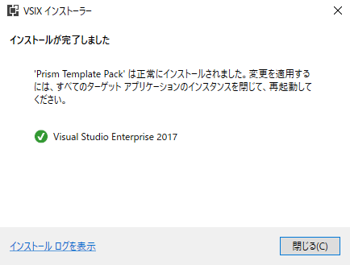
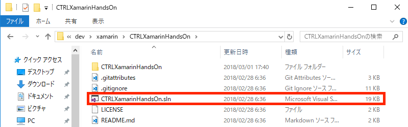

# CTRL Xamarin講習 事前準備手順書

本資料は Xamarin講習を受ける前に行う事前準備をまとめたものです。

当日に準備を始めるとまず間違いなく終わらないので講習を受ける人は手順7の起動確認までを必ず事前に準備をしておいてください。

## 手順 1 : PCスペックの確認

開発環境はWindowsで、推奨スペックはCore i5-6200U、メモリ8GB以上、SSDの空き容量が40GB以上です。

最低でも適当なCore i5、メモリ4GB、HDD/SSDの空き容量が30GBは必要です。

推奨PCの場合はメモリが4GBでエミュレータの稼働は絶望的なので、Android実機（Android 5.0 ~ Android 8.0）を用意するか、UWP（Windows 10 Fall Creators Updateが必須）で講習を行いましょう。

また、スペックに余裕のある人でもなるべく Android 実機を持ってきましょう。（エミュレーターはトラブルが発生しやすいし、遅い）

## 手順 2 : Windows10にFall Creators Updateを適応する（Windows8.xの人はスキップ）

このサイトを参考に、Windowsのバージョンを確認してください。

[Windows 10のメジャーアップデート「Fall Creators Update」で何が変わったのか？](http://www.atmarkit.co.jp/ait/articles/1710/20/news033.html)

「バージョン」が1709であればFall Creators Updateが適応されているので問題ありません。

1607などの人はFall Creators Updateが適応されていないのでウイルス対策ソフトをアンインストールし、WindowsDefenderを無効化した後、 [Windows 10 Update Assistant](https://www.microsoft.com/ja-jp/software-download/windows10) を使用してFall Creators Updateを適応してください。（推奨PCはWindowsUpdateがブロックされて自動的にアップデートされない！！！）

Fall Creators Updateの適応が終わったらWindows Defenderを有効化し、ウイルス対策ソフトをインストールしておいてください。

## 手順 3 : Visual Studio 2017を最新版に更新する

まだVisual Studio 2017(Community or Enterprise)をインストールしていない人はインストールしておいてください。

[Visual Studio IDE](https://www.visualstudio.com/ja/vs/)

インストールしてある人はスタートメニューからVisual Studio Installerを起動しましょう。

Visual Studio Installerを起動すると下のような画面になります。起動後しばらく待って、赤線で囲った部分が更新に変わった場合は更新をクリックしてVisualStudioを最新版にしましょう。既に最新版になっている場合は何もしなくて良いです。（現時点での最新版は15.5.7）

## 手順 4 : .Netによるモバイル開発のインストール

次はVisual StudioにXamarinをインストールしていきます。
Visual Studio Installerの変更をクリックしましょう。

インストールウィザードが開いたら、モバイル&ゲームにある「.Netによるモバイル開発」にチェックを付けましょう。

右側でチェックされているコンポーネントがインストールされます。基本的には初期状態のままで大丈夫ですが、Windows10の人は追加で「Xamarin用ユニバーサルWindowsプラットフォームツール」にチェックしておきましょう。

各コンポーネントについて詳しく知りたい人は[Xamarin やりたい人向け Visual Studio 2017 インストール手引書](http://ytabuchi.hatenablog.com/entry/visualstudio2017)を参照してください。

合計インストールサイズは26GBくらいになるはずです。右下の変更ボタンをクリックするとインストールが始まります。

## 手順 5 : Prism Template Packのインストール

Visual Studioにスニペットを追加するためにPrism Template Packという拡張機能を導入します。

下のリンクからダウンロードし、実行しましょう。

[Prism Template Pack](https://marketplace.visualstudio.com/items?itemName=BrianLagunas.PrismTemplatePack)

インストールをクリック。

下のような画面が出ればインストール完了です。

## 手順 6 : 配布ファイルをクローンまたはダウンロード

講習で使うファイルをGithubに置いてあるので下のリンクからダウンロードします。

https://github.com/poketorena/CTRLXamarinHandsOn

「Clone or Download」から「Download ZIP」をクリックしてダウンロードします。Gitが分かる人はクローンしても構いません。

ダウンロードして解凍したら、C:\dev\xamarin のようなパスが短くなる場所にフォルダを配置してください。

これはパスが長すぎてプロジェクトの作成やビルドができなくなってしまうのを回避するためです。対処法もありますがコマンドを打つ必要があるので紹介に留めておきます。

[Xamarin.Forms のプロジェクトでフォルダパスが長すぎてエラーになってしまうときの対処法 その2](http://blog.okazuki.jp/entry/2017/09/17/130715)

## 手順 7 : プロジェクトファイルを開いてAndroid、UWPプロジェクトを実行してみる

「CTRLXamarinHandsOn.sln」をクリックしてソリューションファイルを開きます。

もし、「開発者モード」を要求するダイアログが出た場合は開発者モードにしておきましょう。（Windows10のみ、Windows8.xはUWP開発はできないのでUWPプロジェクトは無効にしておく）

7.1、7.2、7.3はいずれかの環境で実行できれば構いませんがAndroid実機とUWPの両方で動くのが理想です。iOSは未検証（誰か人柱...）

また、初回ビルド時は大量のダウンロード（1GBくらい?）が発生し時間がかかるのでお茶でも飲みながら気長に待ちましょう。（光 + SSD環境で2分なので光 + HDDでは10分?）

### 手順 7.1 Androidプロジェクトをエミュレータで実行する（PCのメモリがたくさんある人）

メニューバーの近くにスタートアッププロジェクト（ビルドして実行するプロジェクト）を設定する項目があるので「CTRLXamarinHandsOn.Android」を選択しましょう。

次に、実行するエミュレータを選択します。下の図では「Nexus5X_API26(Android 8.0 - API 26)」を選択していますが、正常にインストールできていれば「Android_Accelerated_Nougat(Android 7.1 - API 25)」または「VisualStudio_android-23_x86_phone (Android 6.0 - API 23)」等があるはずなのでそれを選びましょう。

エミュレータ名をクリック、またはF5で実行。

下のような画面になれば成功です。

### 手順 7.2 Androidプロジェクトを実機で実行する（PCのメモリが少ない人, Android実機を持っている人）

Android実機の設定を開き、開発者向けオプションを開きます。開発者向けオプションがない場合は端末情報を開き、ビルド番号を7回タップして開発者向けオプションを表示する設定にしておきましょう。

開発者向けオプションを開くと、USBデバッグという項目があるので有効化しておきます。

次に、データ通信機能を持ったUSBケーブルでPCとAndroid実機を接続します。ここから先はエミュレータと同じです。

メニューバーの近くにスタートアッププロジェクト（ビルドして実行するプロジェクト）を設定する項目があるので「CTRLXamarinHandsOn.Android」を選択しましょう。

次に、実行するAndroid端末を選択します。下の図ではXperiaZ5（SOV32）を選択していますが、PCに接続した自分のAndroid端末を選択してください。

Android端末名をクリック、またはF5で実行。

下のような画面になれば成功です。

### 手順 7.3 UWPプロジェクトを実行する（Windows10のみ, PCのメモリが少ない人）

メニューバーの近くにスタートアッププロジェクト（ビルドして実行するプロジェクト）を設定する項目があるので「CTRLXamarinHandsOn.UWP（Universal Windows）」を選択しましょう。

次に、実行する環境を選択しますがこれはデフォルトの「ローカルコンピューター」のままでよいです。

「ローカルコンピューター」をクリック、またはF5で実行。

下のような画面になれば成功です。

## うまくいかない場合
- まずはソリューションをクリーンしてリビルド
- AndroidSDKを更新する - 
[ここ](https://github.com/ytabuchi/XamarinHOL/blob/master/XamarinHandsOn_Prepare_JXUG.pdf)の18,19ページを参考に
- 実機の場合で接続したのにVisualStudioに表示されない場合はAndroidのドライバを再インストールしてみる
- Android8.1はたぶん無理 - 5.0~8.0は動くはず
- [JDK8](http://www.oracle.com/technetwork/java/javase/downloads/jdk8-downloads-2133151.html)を入れ直す - 9だと動かないよ
- うまくいかないときは気軽にTwitterやSlackで連絡してください（環境構築が一番めんどくさいので...）

## エミュレータが遅い
- 新しくHAXMのエミュレータを作る

[Xamarin でも使える高速 Android エミュレータを簡単に作る方法(Windows編)](https://qiita.com/amay077/items/6176fdaf4aa3a13b9a6d)